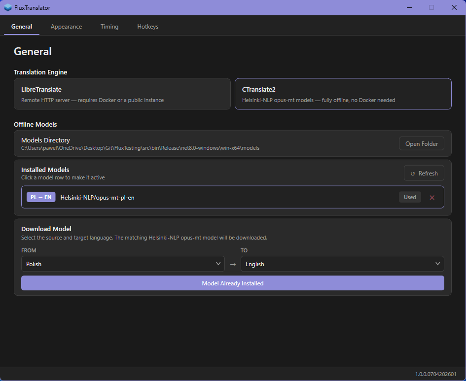
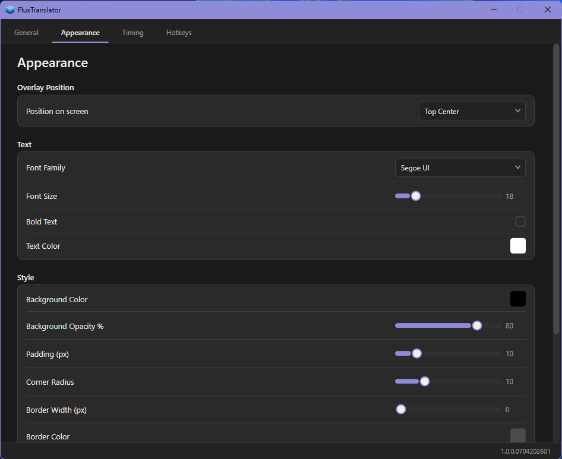
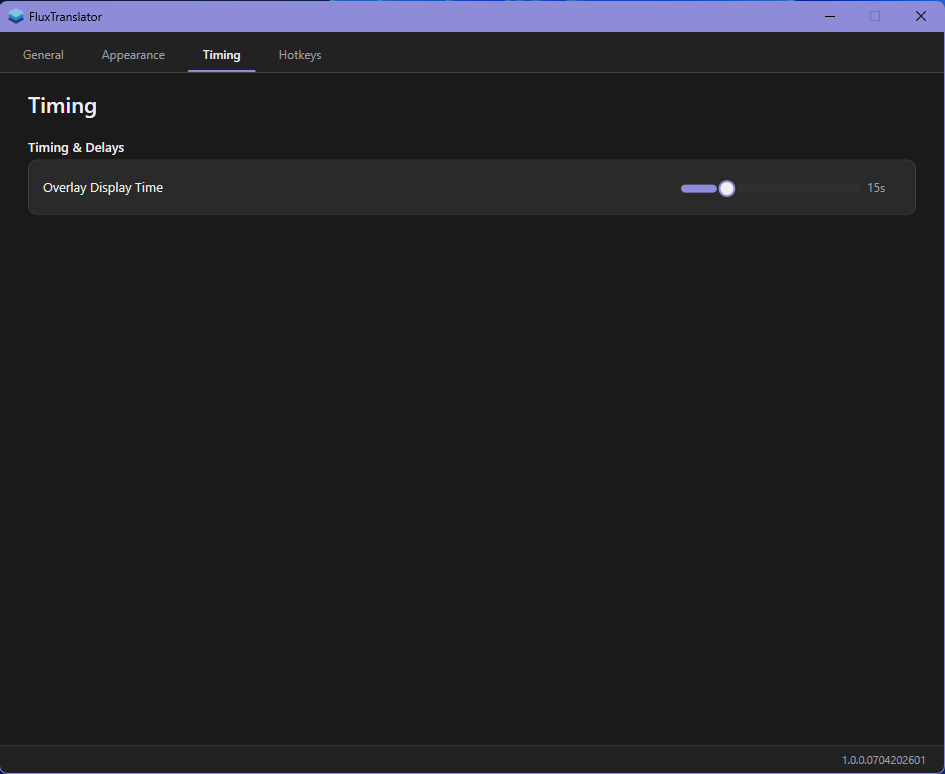
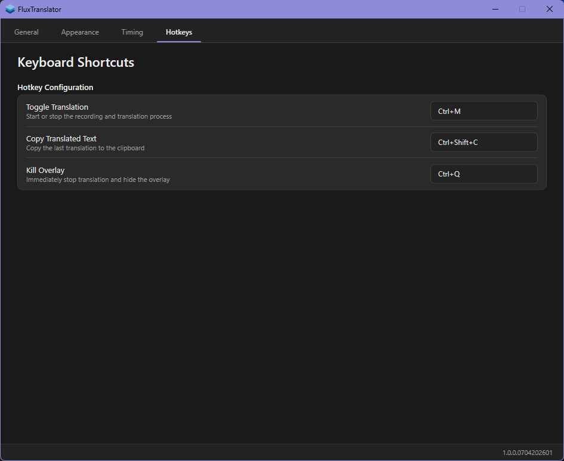

# FluxTranslator

FluxTranslator is a Windows desktop overlay for speech to text translation. It listens to your microphone, recognises speech, translates it in real time and displays the result in a compact on screen overlay.

## Demo

<p align="center">
   
</p>

<table align="center">
   <tr>
      <td></td>
      <td></td>
   </tr>
   <tr>
      <td></td>
      <td></td>
   </tr>
</table>

## Features

- **Speech recognition** using your microphone.
- **Real-time translation** with two translation modes:
   - **LibreTranslate**
   - **CTranslate2**
- **Overlay UI** that displays translated text on top of other applications.
- **Customisable appearance** including font, size, colors, opacity, padding, borders, and screen position.
- **Hotkey support** for starting recognition, copying the last translation, and stopping everything quickly.
- **Model management** directly from the app.

## Installation

### Windows
1. Go to the [Releases](https://github.com/PawelKawka/FluxTranslator/releases) page.
2. Download `FluxTranslator_Setup.exe`.
3. Run the installer and follow the setup wizard.
4. Launch the app from the Start Menu or Desktop shortcut.

#### Windows SmartScreen Warning

- Because this project is free and open source the installer does not come with a digital certificate. Windows may display a SmartScreen message when you first run it.


## How it works

FluxTranslator uses a python backend for microphone capture and translation related tasks.

- **Speech to text** is performed through a local Python backend.
- **LibreTranslate mode** sends text to a LibreTranslate server.
- **CTranslate2 mode** runs translation locally using downloaded models.

## Translation Engines

### LibreTranslate
- Default endpoint: `http://localhost:5000/translate`

#### LibreTranslate setup with Docker

If LibreTranslate is not installed yet, the easiest way to run it is with Docker.

1. Download and install Docker Desktop from [docker.com](https://www.docker.com/).
2. Start Docker Desktop and wait until Docker is running.
3. Run LibreTranslate in a terminal:

```bash
docker run -d --name libretranslate -p 5000:5000 -e LT_LOAD_ONLY=LANG,LANG libretranslate/libretranslate
```

Notes:
- `LT_LOAD_ONLY=en,pl` loads only the selected languages and helps reduce RAM usage.
- After starting the container, use `http://localhost:5000/translate` in FluxTranslator.
- If you want more languages, for example English, Polish and German, use `LT_LOAD_ONLY=en,pl,de`.

### CTranslate2
- Works offline after downloading supported models.
- Uses Helsinki-NLP / Opus-MT models converted for CTranslate2.
- Best choice if you want local translation without depending on an external service.

## Supported Languages

FluxTranslator includes support for common source and target languages such as:

- English
- Polish
- German
- Russian
- French
- Italian
- Spanish
- Czech
- Ukrainian
- Chinese
- Japanese
- Korean
- Portuguese
- Dutch
- Swedish
- Finnish
- Danish
- Norwegian
- Turkish
- Arabic

## About

- Developed by Pawel Kawka.
- Open source and free to use.
